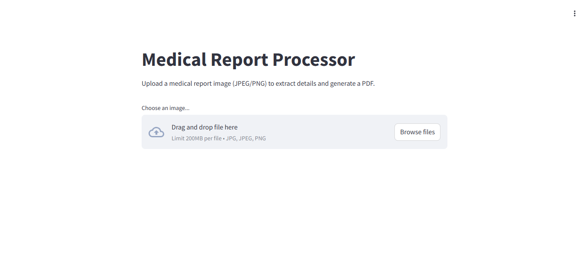
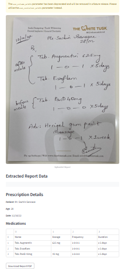
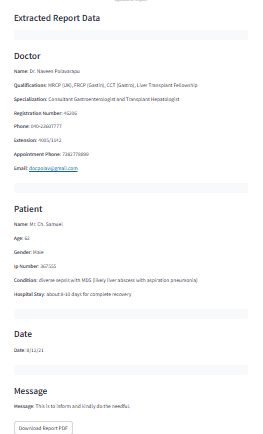

# Medical Report Processor

A Streamlit-based web application that processes medical report images (e.g., prescriptions or consultation notes) using OCR to extract structured data and generate formatted PDF reports. The app intelligently displays either prescription details (patient info and medications) or comprehensive details (doctor, patient, contact info, date) based on the extracted data.

## Features
- Upload JPEG/PNG images of medical reports.
- Extracts data using Mistral OCR into a JSON format.
- Displays extracted data in a clean, organized UI with boxed sections.
- Generates a downloadable PDF report:
  - For prescriptions: Patient details and medication table.
  - For non-prescriptions: Doctor, patient, contact info, and date.
- Runs in Google Colab with ngrok for easy access.

## Fine tuning
  - Fine-tuning was used to train a TinyLlama model with a LoRA adapter on the truehealth/medicationqa dataset to correct misspelled medication names and provide explanations (e.g., correcting "Tab. Augmentin" to "Amoxicillin/Clavulanate").
    
## Use of Fine-Tuning
It enabled the model to accurately identify and explain correct medication names from OCR-extracted data, enhancing the app’s ability to verify prescriptions before displaying or generating PDF reports.

## Screenshots

### Home Page

*Upload an image to start processing.*

### Prescription Output

*Formatted display of a prescription with patient details and medications table.*

### Non-Prescription Output

*Structured view of doctor, patient, contact info, and date for non-prescription reports.*

## Tech Stack
- **Python**: Core programming language.
- **Streamlit**: Web app framework for the UI.
- **Mistral AI**: OCR and JSON parsing via `mistralai` API.
- **ReportLab**: PDF generation.
- **Pyngrok**: Exposes the app via a public URL.
- **Google Colab**: Runtime environment.

## Setup Instructions
1. **Clone the Repository**:
   ```bash
   git clone https://github.com/CodeRxWizard/Medical-Report-Processor.git
